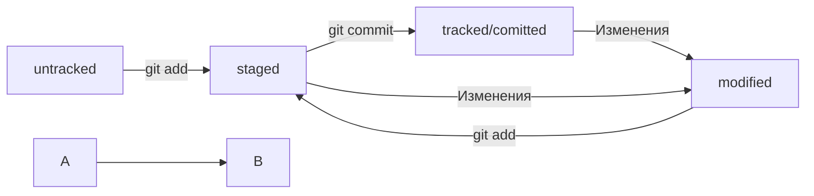

## Команды git  
- **git init** - создать локальный репозиторий git  
- **git add .** - подготовить изменения к коммиту  
- **git commit -m "COMMENT"** - создать коммит  
- **git remote add origin URL** - в первый раз загрузи все коммиты из локального репозитория в удалённый с названием origin  
- **git remote -v** - проверь, что репозитории действительно связались  
- **git push -u origin main** - привяжи локальный репозиторий к удалённому с URL  
- **git push** - загрузи коммиты в удалённый репозиторий после того, как он был привязан с помощью флага -u  
- **git clone URL** - склонируй репозиторий с URL на мой локальный компьютер  
- **git log** - покажи лог
- **git log --oneline** - покажи упрощённыйлог

## Команды SSH  
**ssh-keygen** - сгенерировать ключи  

## Статусы
modified + git add = staged

