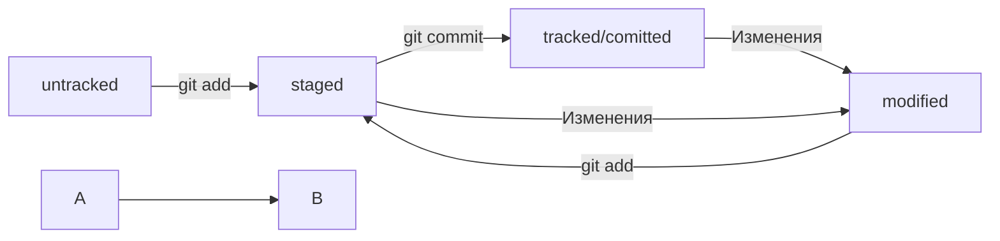

### Команды git
- **git init** - создать локальный репозиторий git  
- **git add .** - подготовить изменения к коммиту  
- **git commit -m "COMMENT"** - создать коммит  
- **git remote add origin URL** - в первый раз загрузи все коммиты из локального репозитория в удалённый с названием origin  
- **git remote -v** - проверь, что репозитории действительно связались  
- **git push -u origin main** - привяжи локальный репозиторий к удалённому с URL  
- **git push** - загрузи коммиты в удалённый репозиторий после того, как он был привязан с помощью флага -u  
- **git clone URL** - склонируй репозиторий с URL на мой локальный компьютер  
- **git log** - покажи лог
- **git log --oneline** - покажи упрощённыйлог

### Команды SSH  
**ssh-keygen** - сгенерировать ключи  

### Статусы
modified + git add = staged


### Исправление последнего коммита

Пример:

```bash
$ git add common.css
# добавили файл common.css в список на коммит как обычно
```

```bash
# но вместо команды commit -m '...'
# будет:
$ git commit --amend --no-edit
# коммит в истории всё ещё один (но у него новый хеш) 
```

**--amend --no-edit** - С опцией --amend команда commit создаст новый коммит, которым заменит ваш последний.  
При этом будут учтены изменения как старого коммита, так и нового.  
Обратите внимание на опцию **--no-edit**. Она сообщает команде commit, что сообщение коммита нужно оставить как было.  
Также **--amend -m "Новое название"** используют для изменения названия коммита.  
Однако нужно всегда помнить, что при её выполнении создаётся новый коммит, который будет иметь новый хеш.  
Поэтому не изменяйте ваш последний коммит, если вы уже отправили его в общий репозиторий.  
В таком случае придется добавить новый коммит с одним файлом common.css.  

### Как выйти из Vim

Нажмите клавишу **Esc**.  
Наберите последовательность символов **:qa!**.  
Нажмите **Enter**.  
Откройте учебник по Vim командой **vimtutor ru**.  

### Откат изменений
**git restore --staged <file>** - Убрать файл из staging  
**git restore --staged .** - сбросит всю текущую папку (.)  
**git reset --hard <commit hash>** - откатить коммит до указанной ветки с удалением всех лишних коммитов  
**git restore <file>** - отменит модификацию файла который не нужно было трогать, но не уберет его из staging если он там.  

### Просмотр изменений
**git diff** - сравнит последнюю закоммиченную версию файла с текущей (изменённой) версией.  
По умолчанию команда не показывает изменения в staged-файлах — только в modified.  
Чтобы всё-таки просмотреть изменения в staged, нужно использовать **git diff --staged**.  
**git diff 80a668d HEAD** - Сравнение двух любых коммитов  
