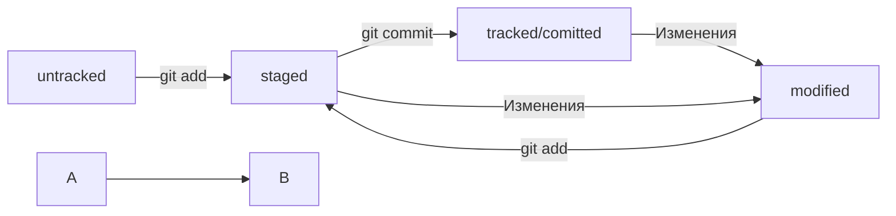

### Команды git
- **git init** - создать локальный репозиторий git  
- **git add .** - подготовить изменения к коммиту  
- **git commit -m "COMMENT"** - создать коммит  
- **git remote add origin URL** - в первый раз загрузи все коммиты из локального репозитория в удалённый с названием origin  
- **git remote -v** - проверь, что репозитории действительно связались  
- **git push -u origin main** - привяжи локальный репозиторий к удалённому с URL  
- **git remote rm origin** - удалить текущий origin  
- **git remote add origin** - перепривязать локальный проект к другому удаленному проекту после удаления origin  
- **git push** - загрузи коммиты в удалённый репозиторий после того, как он был привязан с помощью флага -u  
- **git clone URL** - склонируй репозиторий с URL на мой локальный компьютер  
- **git log** - покажи лог
- **git log --oneline** - покажи упрощённыйлог

### Команды SSH  
**ssh-keygen** - сгенерировать ключи  

### Статусы
modified + git add = staged


### Исправление последнего коммита

Пример:

```bash
$ git add common.css
# добавили файл common.css в список на коммит как обычно
```

```bash
# но вместо команды commit -m '...'
# будет:
$ git commit --amend --no-edit
# коммит в истории всё ещё один (но у него новый хеш) 
```

**--amend --no-edit** - С опцией --amend команда commit создаст новый коммит, которым заменит ваш последний.  
При этом будут учтены изменения как старого коммита, так и нового.  
Обратите внимание на опцию **--no-edit**. Она сообщает команде commit, что сообщение коммита нужно оставить как было.  
Также **--amend -m "Новое название"** используют для изменения названия коммита.  
Однако нужно всегда помнить, что при её выполнении создаётся новый коммит, который будет иметь новый хеш.  
Поэтому не изменяйте ваш последний коммит, если вы уже отправили его в общий репозиторий.  
В таком случае придется добавить новый коммит с одним файлом common.css.  

### Как выйти из Vim

Нажмите клавишу **Esc**.  
Наберите последовательность символов **:qa!**.  
Нажмите **Enter**.  
Откройте учебник по Vim командой **vimtutor ru**.  

### Откат изменений
**git restore --staged <file>** - Убрать файл из staging  
**git restore --staged .** - сбросит всю текущую папку (.)  
**git reset --hard <commit hash>** - откатить коммит до указанной ветки с удалением всех лишних коммитов  
**git restore <file>** - отменит модификацию файла который не нужно было трогать, но не уберет его из staging если он там.  

### Просмотр изменений
**git diff** - сравнит последнюю закоммиченную версию файла с текущей (изменённой) версией.  
По умолчанию команда не показывает изменения в staged-файлах — только в modified.  
Чтобы всё-таки просмотреть изменения в staged, нужно использовать **git diff --staged**.  
**git diff 80a668d HEAD** - Сравнение двух любых коммитов  

### Игнорируемые файлы .gitignore
**git status --ignored** - вывести статус с игнорируемыми файлами  
  
Содержимое файла .gitignore  
**имя и расширение файла** - игнор всех этих файлов везде  
**\*.jpeg** - игнорировать все файлы которые заканчиваются на .jpeg  
**docs/\*/tmp** - игнорировать все файлы "tmp" во всех подпапках папки docs  
\* - игнорировать всё  
**file??.txt** - игнорировать все файлы у которых есть два знака после слова file и окончание .txt.  
**file[0-2].txt** - игнорировать файлы file0.txt, file1.txt и file2.txt  
**/todo.txt** - игнорировать todo.txt в корне репозитория  
**build/** - игнорировать папку build  
**docs/\*\*/tmp** - игнорировать всё, что находится между /docs и /tmp, и даже docs/tmp.  
**!doge.jpeg** - отмена игнора для doge.jpeg если заигнорены все .jpeg.  

Пример:  

```gitignore
# игнорировать все файлы в каталоге build
build/

# игнорировать все .log файлы
*.log

# не игнорировать *.log файлы в examples
# потому что это пример для документации
!examples/**/*.log 
```

### Ветки
**git branch** - Просмотр веток  
**git branch <название_ветки>** - Создать ветку  
**git checkout <название_ветки>** - Перейти в другу ветку  
**git checkout -b <название_ветки>** - Создать ветку и сразу переключиться на неё  
**git branch -a** - Показать все ветки включая удаленные remotes/origin.  
**git diff <название_ветки1> <название_ветки2>** - Сравнить ветки.  
**git diff 2ea56ab~ 2ea56ab** - Сравнить предыдущий коммит от указанного перед ~, с указанным в конце коммитом  
**git diff feature/diff\~2 feature/diff** - Сравнить коммит из ветки feature/diff смещенный на 2 к началу истории с текущим коммитом ветки.  
**git merge <название_ветки>** - Выполнить слияние.  
**git branch -D <название_ветки>** - Удалить ветку после объединения.  
**git branch -d <название_ветки>** - Безопасно удалить ветку (сработает только если было полное объединение или ветка пуста).  
Удаление локальной ветки через Git не удаляет ветку на GitHub!  
  
**git push -u origin <Ветка>** - Запушить ветку

pull request - делается на сайте  
  
**git pull** - Подтянуть изменения из проекта к себе  
Пример:

```text
$ git checkout main # перешли в main
$ git pull # подтянули новые изменения в main
$ git checkout my-branch # вернулись в рабочую ветку my-branch
$ git merge main # влили main в новую ветку my-branch
$ git push -u origin my-branch # отправили ветку my-branch в удалённый репозиторий 
```
