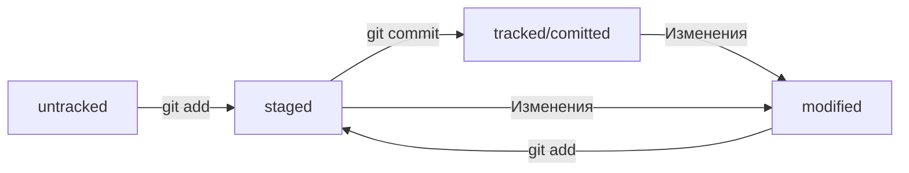

### Термины
**HEAD** - Родитель следующего коммита, указатель на текущую ветку, 
которая, в свою очередь, является указателем на последний коммит, 
сделанный в этой ветке. Упрощенное обозначение **@~**.  
**ORIG_HEAD** - Состояние HEAD, которое было до выполнения последней 
изменяющей команды.  
**Индекс** - Буфер подготовки к коммиту, снимок следующего намеченного коммита.  
**Песочница** - Рабочий Каталог.  

### Жизненный цикл
**modified + git add = staged**  


```mermaid
graph LR;
  untracked -- "git add" --> staged;
  staged    -- "git commit"     --> tracked/comitted;
  tracked/comitted -- "Изменения" --> modified;
  modified -- "git add" --> staged;
  staged -- "Изменения" --> modified;
``` 
**tracked** - Отслеживаемый файл.  
**untracked** - Не отслеживаемый файл.  
**staged** - Файл добавлен в область ожидания и готов к сохранению (коммиту)  
**modified** - Файл в рабочем каталоге отличается от файла в текущем коммите.  
**comitted**  Последние изменения файла закоммичены, отличий нет.

### Настройка Git
`git config --global user.email "your_email@example.com"` Глобально установить 
почту пользователя.  
`git config --global core.editor "nano -w"` Глобально установить основным 
редактором nano вместо vim.  
`git config --global alias.gr 'log --graph --oneline --decorate --all'` 
Добавить аллиас **gr** для команды **log --graph --oneline --decorate --all**.  
`git config --global --unset alias.gr` Удалить глобальную настройку по 
имени переменной.

### Основные команды
`git init` Создать локальный репозиторий git в текущей дирректории.  
`git init <name>` Создать в текущей дирректории новую папку с репозиторием.  
`git add .` Подготовить изменения всех файлов к коммиту.  
`git commit -m "comment"` Создать коммит с комментарием **comment**.  
`git commit -a -m "comment"` Создать коммит с комментарием **comment** и
предварительной подготовкой всех файлов к коммиту.  
`git status` Показать текущий статус репозитория.  
`git log` Показать историю коммитов.

### Объединение
`git pull --merge` Объединить коммиты и проанализировать локальные
и удалённые изменения.  
`git merge <branch_name>` Объединить указанную ветку в текущую.

### Перебазирование
`git rebase <commin_hash>` Переставить коммит ответвления текущей ветки
вместе с самой веткой на указанный коммит.   
`git rebase --continue` Продолжить перебазирование после решения конфликтов.  
`rebase --abort` Отменить перебазирование, если оно еще в процессе.

### Откладывание изменений
`git stash` Спрятать изменения, которые ещё не готовы стать коммитом,
в хранилище.  
`git stash list` Показать список отложенных изменений.  
`git stash pop` Достать последний набор отложенных изменений,
удалить его из хранилища и применить к исходному коду.  
`git stash apply stash@{n}` Вернуть конкретные изменения по их
номеру из списка (n).

### Ветки
`git branch` Просмотр веток.  
`git branch <название_ветки>` Создать ветку.  
`git checkout <название_ветки>` Перейти в другую ветку.  
`git checkout -b <название_ветки>` Создать ветку и сразу переключиться на неё.
`git checkout -b <branch_name> <commit_hash>` Создать новую ветку от указанного
коммита и сразу переключиться на неё.  
`git branch -a` Показать все ветки включая ветки в удаленном 
репозитории remotes/origin.  
`git diff <branch_name> <branch_name>` Сравнить ветки.  
`git diff <commit_hash>~ <commit_hash>` Сравнить предыдущий коммит от указанного
перед **~**, с указанным в конце коммитом.  
`git diff feature/diff\~2 feature/diff` Сравнить коммит из ветки
**feature/diff** смещенный на 2 к началу истории с текущим коммитом ветки.  
`git merge <название_ветки>` Выполнить слияние.  
`git branch -D <название_ветки>` Удалить ветку после объединения.  
`git branch -d <название_ветки>` Безопасно удалить ветку (сработает
только если было полное объединение или ветка пуста).  
Удаление локальной ветки через Git не удаляет ветку на GitHub!

### Работа с удаленным репозиторием
`ssh-keygen -t <algorithm> -C "comment"` Сгенерировать SSH ключ 
по указанному алгоритму (рекомендуется ed25519), а в качестве **comment** 
обычно указывают свой email. Ключ нужен для соединения локального проекта
с удаленным репозиторием.  
`git pull` Подтянуть изменения из проекта к себе.  
`git push -u origin <branch_name>` Запушить ветку.  
`git clone <URL>` Склонировать репозиторий с URL на мой локальный компьютер.  
`git remote add origin <URL>` В первый раз загрузить все коммиты
из локального репозитория в удалённый с названием **origin**.  
`git push -u origin main` Привязать локальный репозиторий к удалённому с URL.  
`git remote -v` Проверить, что репозитории действительно связались.  
`git push` Загрузить коммиты в удалённый репозиторий после того,
как он был привязан с помощью флага **-u**.  
`git remote set-url origin <URL>` Заменить **orgin** на новый.  
`git remote rm origin` Удалить текущий origin.  
`git remote add origin` Перепривязать локальный проект к другому
удаленному проекту после удаления origin.  
`git remote set-url origin` Установить адрес удалённого репозитория (origin),
куда будут загружаться и откуда будут выгружаться новые коммиты.  
`git fetch` Собрать коммиты, которых нет в текущей ветке, из целевой,
а затем сохранить их в локальном репозитории, не изменяя его состояние.

### Просмотр репозитория и коммитов
`git log` Показать лог.  
`git log --oneline` Показать упрощённый лог.  
`git show <commit_hash>` Отобразить изменения в файлах указанного коммита.  
`git show --name-only <commit_hash>` Отобразить только имена измененных файлов 
указанного коммита.  
`git show --oneline <commit_hash>` Упрощенно отобразить изменения в файлах 
указанного коммита.  
`git log --graph` Показать детальный лог с графом веток.  
`git log --graph --oneline --decorate --all` Показать упрощенный лог всего 
проекта с графом веток.  
`git log --oneline --graph --decorate -5` Показать упрощенный лог последних 
пяти коммитов с графом веток.  
`git cat-file -p <commit_hash>` Показать метаданные указанного коммита.  

### Просмотр изменений в файлах
`git diff` Сравнить последнюю закоммиченную версию файла с текущей 
(изменённой) версией. По умолчанию команда не показывает изменения 
в staged-файлах — только в modified.  
`git diff --staged` Чтобы всё-таки просмотреть изменения в staged.  
`git diff <commit_hash> <commit_hash>` Сравнить два коммита.

### Пример работы
```text
$ git checkout main # перешли в main
$ git pull # подтянули новые изменения в main
$ git checkout my-branch # вернулись в рабочую ветку my-branch
$ git merge main # влили main в новую ветку my-branch
$ git push -u origin my-branch # отправили ветку my-branch в удалённый репозиторий 
```
**pull request** - Делается на сайте или через IDE.

### Маневрирование и исправление ошибок 
`git blame` (англ. «обвинять») Показывает, кто и когда внёс
изменение в код.  
`git diff` (от англ. difference — «различие») Отображает изменения
файлов в коммите.  
`git reflog` Посмотреть всю историю локальных закоммиченных изменений в проекте.  
`git reflog <branch_name>` Посмотреть историю локальных закоммиченных изменений
по конкретной ветке.  
`git restore --staged <file_name>` Убрать файл из staging. 
Файл остается под отслеживанием Git.
При следующем коммите файл снова попадет в репозиторий.  
`git restore --staged .` Сбросит всю текущую папку (.)  
`git rm --cached <file_name>` Убрать файл из индекса.
При следующем коммите Git удалит файл из репозитория, но сохранит на 
вашем жестком диске.  
`git squash` (англ. «сдавить», «сплющить»)
Совмещает изменения из нескольких коммитов и «схлопывает» их в один. 
Используйте эту операцию, чтобы в истории не было лишних коммитов.  
`git commit --allow-empty -m "comment"` Создать пустой коммит
с комментарием **comment**.  
`git reset --hard <commit_hash>` Откатить коммит до указанного с 
удалением всех лишних коммитов.  
`git reset --soft @~` Отменить последний коммит, но оставить именения в
файлах как будто они еще не закоммичены.  
`git reset --mixed <commit_hash>` Переместить указатель ветки на указанный 
коммит и убрать изменения из индекса, оставив их в рабочем каталоге.  
`git restore <file_name>` Отменить модификацию файла который не нужно было 
трогать, но не убирать его из staging если он там.  
`git push --force` Переписать удалённую ветку вашим вариантом истории, 
даже если коллега успел запушить новые коммиты.  
`git push --force-with-lease` Переписать удалённую ветку вашим вариантом 
истории, при условии что удаленная ветка не менялась кем-то другим.  
`git push origin <branch_name> --force-with-lease` Ппереписать указанную 
удалённую ветку вашим вариантом истории, при условии что удаленная ветка 
не менялась кем-то другим.  
`git revert -m 1 <commit_hash>` Отменить указанный коммит слияния, не переписывая 
историю. Сохранить состояние основной ветки (родитель №1) и отменить изменения, 
которые были привнесены вторым родителем через этот merge. 
Команда создает новый коммит после указанного, указанный коммит не трогает.  
`git commit --amend --no-edit` Заменить последний коммит на новый, не меняя 
его описание. При этом будут учтены изменения как старого коммита, так и нового.   
`git commit --amend -m "comment"` Заменить последний коммит на новый, 
с заменой описания. При этом будут учтены изменения как старого коммита, 
так и нового.  
`git rebase -i <commit_hash>` Открыть список коммитов после указанного для 
интерактивного редактирования, объединения, удаления или изменения.  
`git rebase -i @~4` Открыть интерактивное редактирование истории последних
четырёх коммитов текущей ветки.  
`git rebase --edit-todo` Редактировать список изменений при интерактивном
перебазировании, если оно еще в процессе.  
`git cherry-pick <commit_hash>` Скопировать изменения из 
указанного коммита в текущую ветку и создать на их основе новый коммит. 
Можно указать несколько **A B** или диапозон коммитов **A..B**.  
`git cherry-pick -n <commit_hash>` Только cкопировать изменения из
указанного коммита в текущую ветку.
`git cherry-pick --continue` Продолжить выполнение команды после 
разрешения конфликтов.  
`git cherry-pick --abort` Отменить выполнение если оно еще в процессе.  

### Как выйти из Vim
Нажмите клавишу **Esc**.  
Наберите последовательность символов `:qa!`.  
Нажмите **Enter**.  
Откройте учебник по Vim командой `vimtutor ru`.

### Игнорируемые файлы .gitignore
`git status --ignored` - Вывести статус с игнорируемыми файлами

Содержимое файла **.gitignore**:  

\* - Игнорировать всё.  
**имя и расширение файла** - Игнор всех этих файлов везде.  
**\*.jpeg** - Игнорировать все файлы которые заканчиваются на **.jpeg**.  
**docs/\*/tmp** - Игнорировать все файлы "tmp" во всех подпапках папки docs.   
**file??.txt** - Игнорировать все файлы у которых есть два знака после
слова file и окончание .txt.  
**file[0-2].txt** - Игнорировать файлы file0.txt, file1.txt и file2.txt.  
**/todo.txt** - Игнорировать todo.txt в корне репозитория.  
**build/** - Игнорировать папку build.  
**docs/\*\*/tmp** - Игнорировать всё, что находится между /docs и /tmp,
и даже docs/tmp.  
**!doge.jpeg** - Отмена игнора для doge.jpeg если заигнорены все .jpeg.

Пример:
```gitignore
# игнорировать все файлы в каталоге build
build/

# игнорировать все .log файлы
*.log

# не игнорировать *.log файлы в examples
# потому что это пример для документации
!examples/**/*.log 
```

### Подходы к работе с Git
**Git Flow** с самым долгим релизным циклом разработки. При этом 
подходе основная работа ведётся в develop, а main стабилизирует 
изменения.  
**GitHub Flow**, в котором отказались от ветки develop, чтобы 
упростить интеграцию новых изменений в main.  
**GitLab Flow**, который ввёл практику использования веток окружения, 
соответствующих стадиям релизов.  
**Trunk-Based Development** с короткоживущими ветками разработки, 
частыми обновлениями main и активным применением CI/CD. 
У этого подхода самый короткий релизный цикл.  
